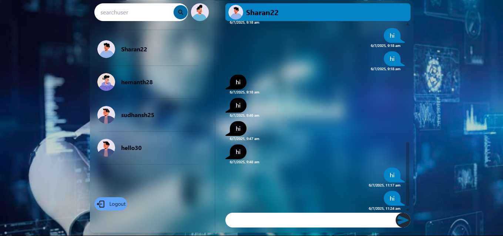

# Real Time Chat App

A real-time chat application built with Node.js, Express, Socket.IO, and React.

## Features
- User authentication
- Real-time messaging
- Online users indicator
- Search users

## Tech Stack
- Node.js
- Express.js
- Socket.IO
- React
- MongoDB

## Installation

1. Clone the repository:
   git clone https://github.com/your-username/realtime-chat-app.git
2. Install backend dependencies:
    cd backend
    npm install
3. Install frontend dependencies:
    cd frontend
    npm install
## Running Locally
### Backend
npm run dev
### Frontend
npm run dev

Create a `.env` file in the backend with:
MONGO_URI=your_mongodb_connection
JWT_SECRET=your_secret_key
PORT=3000

## 📸 Screenshots

### Chat Window

### Login Page

### Register page
![Register Screen] (screenshots/reigsterpage.png)

